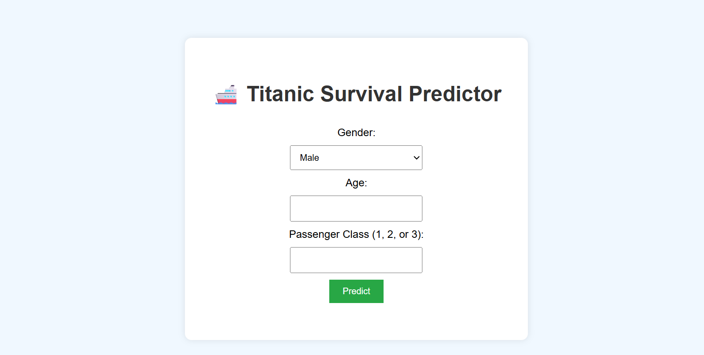
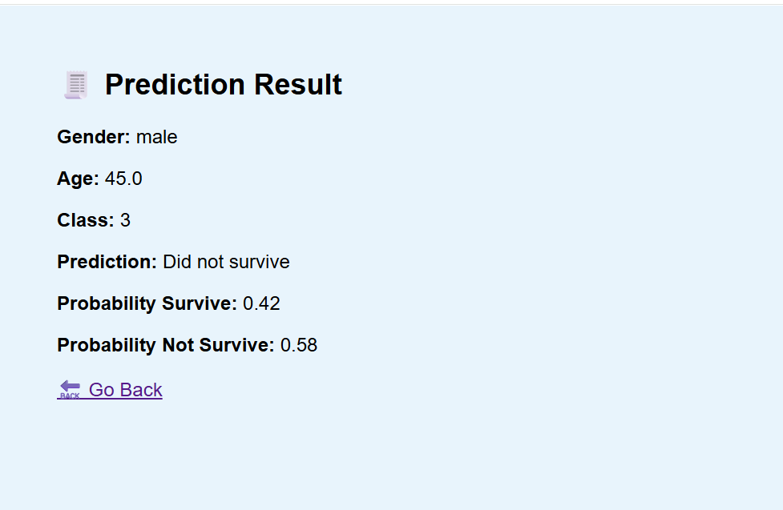

# 🚢 TitanicML Survival Predictor


A FastAPI-powered machine learning application that predicts the survival of Titanic passengers based on their age, gender, and passenger class using a trained Random Forest model.

### 🧾 Web Form Interface


### 📊 Prediction Result


---

## 📊 Project Overview

This project provides both a **web form interface** and a **REST API** for predicting whether a Titanic passenger would survive based on:

- **Passenger Class (Pclass)**
- **Gender**
- **Age**
- 

It uses a **Random Forest Classifier** and includes a built-in data preprocessing pipeline with `StandardScaler` and `LabelEncoder`.

---

## ⚙️ Tech Stack

| Component      | Technology             |
|----------------|------------------------|
| Backend        | FastAPI                |
| ML Framework   | Scikit-learn           |
| Data Handling  | Pandas, NumPy          |
| Model Storage  | Joblib                 |
| Deployment     | Uvicorn                |
| Language       | Python                 |

---

## 🚀 Features

- 🧠 Train and save models from a CSV file
- 🌐 Web interface for prediction via HTML form
- 🔗 REST API endpoints for integration
- 📦 CLI mode for offline predictions
- 📊 Probability-based survival output
- 🧰 Includes full preprocessing pipeline

---

## 📁 Directory Structure

```
TitanicML-Survival-Predictor/
│
├── static/                # Static assets (CSS, banner, etc.)
├── models/                # Saved ML models (generated at runtime)
├── main.py                # Main FastAPI app
├── requirements.txt       # Python dependencies
└── README.md              # This file
```

---

## 🔌 API Endpoints

### `GET /`
- Home page with HTML form interface.

### `GET /predict-form`
- Predict using query parameters (`gender`, `age`, `pclass`) from form submission.

### `GET /predict-manual`
- Predict via query parameters (for API access).
- **Example**:
  ```
  /predict-manual?gender=female&age=25&pclass=1
  ```

---

## 🖥️ How to Run Locally

### 📦 1. Install Requirements
```bash
pip install -r requirements.txt
```

### 🧠 2. Train the Model
Run the script to train the model using your Titanic dataset:
```bash
python main.py
```
> If models already exist in `/models`, it loads them automatically.

### 🌐 3. Start the API Server
```bash
uvicorn main:app --reload
```

Open in browser: [http://127.0.0.1:8000](http://127.0.0.1:8000)

---

## 📈 Sample Prediction Result

```json
{
  "survival": 1,
  "survival_text": "Survived",
  "probability_survive": 0.87,
  "probability_not_survive": 0.13
}
```

---

## 📚 Dataset Reference

This project uses the [Titanic - Machine Learning from Disaster](https://www.kaggle.com/competitions/titanic) dataset from Kaggle.

---

## 🧠 Model Details

- Algorithm: `RandomForestClassifier`
- Preprocessing:
  - Imputation for missing values (median/mode)
  - Categorical encoding for gender
  - Feature scaling using `StandardScaler`
- Evaluation: Data split into training/test using stratified sampling

---
## 👨‍💻 Author

**Muhammad Saeed**  
AI & Data Science Enthusiast  


---

